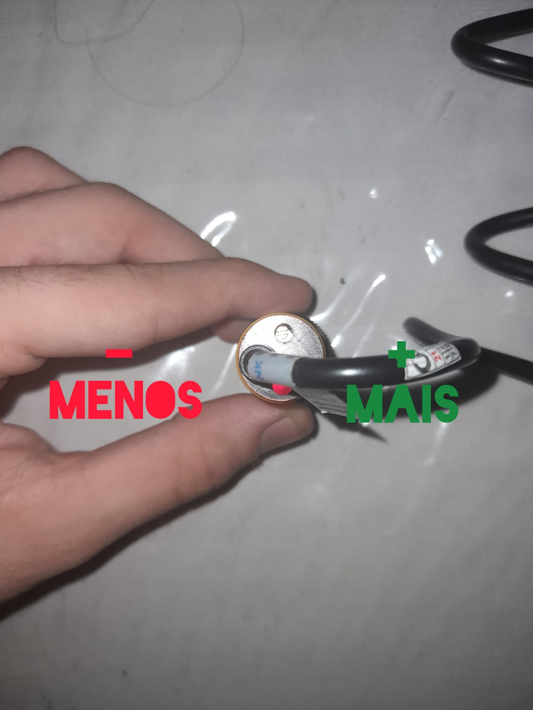

## Sensor E18-D80NK

Em resumo, o sensor E18-D80NK pode ser considerado uma "melhora" do sensor TCRT5000, que já apresentei aqui em projetos como: 
- [Sensor_TCRT5000_e_Leds](https://github.com/Victor-Lis/Sensor_TCRT5000_e_Leds)
- [Sensor_TCRT5000_with_Light_Reflection_Cutoff](https://github.com/Victor-Lis/Sensor_TCRT5000_with_Light_Reflection_Cutoff)
  
A grande diferença é que, o sensor TCR5000 tem sua distância fixa de 2cm e não é possível alterar, já o sensor E18-D80NK é possível regular, este código é parecido com o do projeto [Sensor_TCRT5000_e_Leds](https://github.com/Victor-Lis/Sensor_TCRT5000_e_Leds), porém utilizando o sensor E18-D80NK e ao detectar movimento ele liga uma led de cor verde.

Em suma, ao girar o parafuso na base do sensor para a esquerda a distância é diminuida, já girando para direita é aumentada, seguindo exemplo da foto abaixo:

  

Achei esse sensor muito bacana e muito útil para projetos até porque ele tem já consigo uma mecanismo girátorio que facilita prende-lo em alguma estrutura, mas infelizmente não me será útil, pois já que segue os mesmos moldes do sensor TCRT5000, ele acaba não detectando objetos de tom muito escuro ou pretos. Sendo assim acaba não sendo o ideal para substituir o sensor TCR5000, já que acabaria sofrendo dos mesmos problemas.

Porém para projetos futuros que ainda não estejam adaptados a distância do sensor TCRT5000, o sensor E18-D80NK acaba se provando uma alternativa mais fácil já que é possível ajustar a distância.
